# Reconfigurable UAV + UGV

[](#)
[](https://www.caltech.edu/about/news/caltech-engineers-design-a-robot-that-can-walk-fly-and-skateboard)
[](#)

> **Design project.** This repository documents the mechanical design, sizing, structural analysis, and electronics architecture of the vehicle. It is a CAD + analysis effort, not a software stack.

A hybrid robot that morphs between **quadrotor (UAV)** and **two-wheeled rover (UGV)** modes — inspired by the CalTech M4 Morphbot. The vehicle flies to a search location for rapid response, then transitions to ground mode in cluttered terrain to gain manoeuvrability and dramatically cut power consumption (dynamically stable → statically stable).

Targeted at search-and-rescue missions where pure ground robots get stuck and pure quadrotors burn through battery hovering.

## Demo

<!-- Drag-and-drop reconfig_demo.mp4 here in the GitHub web editor to embed -->

https://github.com/tarunkumarnyu/Reconfigurable-UAV-UGV/raw/main/assets/reconfig_demo.mp4

## Configurations

<p align="center">
  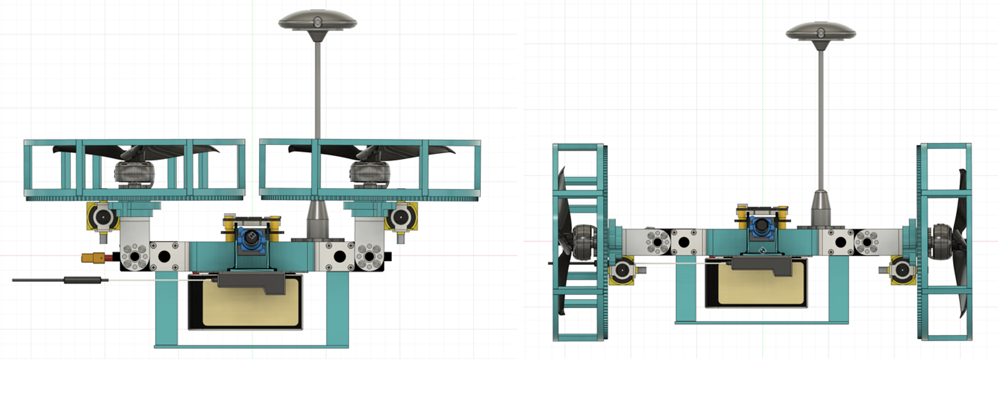
</p>

| Mode | Actuators | When it's used |
|---|---|---|
| **UAV** | 4× BLDC motors | Long-distance traversal, gap-crossing, rapid deployment to a waypoint |
| **UGV** | 2× DC motors driving the wheels through a 1:10 gear ring | Cluttered indoor / collapsed-structure search where flight is unsafe or wasteful |
| **Reconfiguration** | 2× servos rotating the motor-arm assemblies | Switches between modes in place |

Total of **8 actuators**: 4 BLDC + 2 DC + 2 servos.

## Specifications

| | |
|---|---|
| Take-off weight | 1134 g |
| Thrust per motor | 340.2 g (≈1.2× hover thrust) |
| Power required | 31.08 Wh |
| Estimated endurance | 4.21 min (UAV mode) |
| Payload limit | 100 g |
| Length × height | 310 mm × 230 mm |
| Wheelbase (motor mount, diagonal) | 225 mm |
| Wheel diameter | 150 mm |
| Propeller clearance | 33 mm |
| Landing-gear height | 50 mm (15 mm ground clearance in UGV mode) |

<p align="center">
  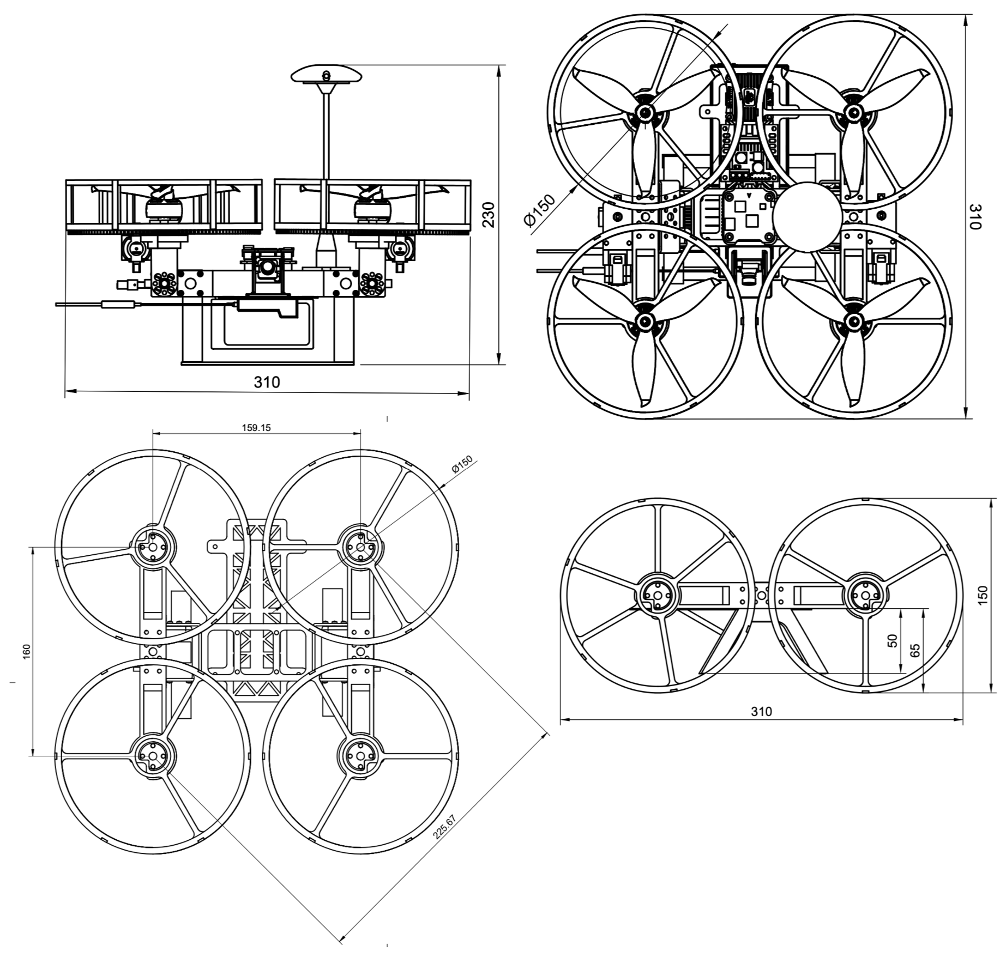
</p>

<p align="center">
  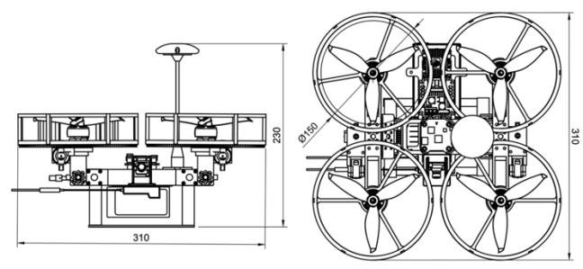
</p>

## Sizing & Power Budget

The vehicle was sized from a target take-off weight, then back-solved through thrust, power, and endurance.

**Weight estimation.**

```
W_to = W_oe + W_pl + W_f
W_oe = 345 g (frame) + 630 g (electronics, no battery) = 975 g
W_f  = 225 g (battery, treated as fuel weight)
W_to = 975 + 225 = 1200 g
```

**Thrust estimation.** Hover requires thrust = weight; we add a 20 % margin for control authority.

```
T_required = 1.2 × 1200 g = 1440 g
T_per_motor = 1440 / 4 = 360 g
```

**Power estimation.** From a test-stand measurement at hover thrust per motor: 3.5 A @ 25.2 V → 88.2 W per motor.

```
P_motors = 4 × 88.2 W = 352.8 W
P_avionics ≈ 20 W
P_total ≈ 373 W
E_5min  = 373 W × (5/60) h = 31.08 Wh
```

**Battery selection.** A **6S 1300 mAh 150C LiPo** delivers 1.3 Ah × 25.2 V = **32.76 Wh**, leaving a small margin over the 31.08 Wh budget.

**Endurance** (capping discharge at 80 % to protect the LiPo):

```
P/W   = 373 / 1.2 ≈ 310.83 W/kg
I_avg = (1.2 × 310.83) / 25.2 ≈ 14.80 A
t     = (1.3 Ah × 0.8) / 14.80 A ≈ 0.0703 h ≈ 4.22 min
```

The 4.22 min UAV endurance is the **worst case** (continuous hover). UGV mode draws an order of magnitude less because the platform is statically stable on its wheels — this is the entire reason for the hybrid design.

## System Architecture

<p align="center">
  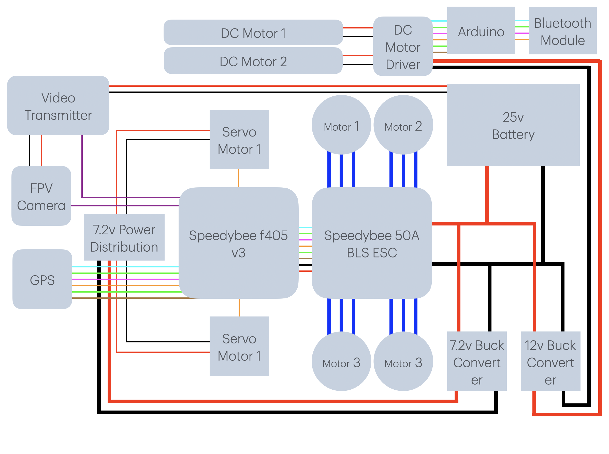
</p>

**Flight controller.** STM32F405 ARM microcontroller with 6× UART for peripherals. Runs the UAV control loop and routes commands during reconfiguration.

**Ground controller.** Separate ATmega328-based board drives the H-bridge for the DC wheel motors in UGV mode — keeps the high-current ground drive isolated from the flight controller.

**Sensing.**
- **DPS310 barometer** — altitude hold.
- **Ublox NEO-M8N GPS** — 0.6–0.9 m position accuracy, on FC UART6 for waypoint navigation.
- **Compass** — heading reference for waypoint following, on I²C.
- **2.4 GHz SBUS receiver** — manual override, on UART2.

**FPV.** 1200 TVL 5 MP camera + 5.8 GHz video transmitter streaming live to the ground station's FPV display.

**ESCs.** 4-in-1 integrated 55 A ESC — single board for all four BLDC motors, total weight 15 g.

**Power tree.**
- 6S 1350 mAh Li-ion → 25.2 V → 4-in-1 ESC (BLDCs)
- LM2596S buck → 12 V → H-bridge → DC wheel motors
- XL4005 buck → 7.2 V @ 5 A → reconfiguration servos

## Structural Design

The frame has three structural sub-assemblies: **central body**, **motor-mount beams**, and **wheels**. Most parts are 3D printed in PLA+; the central chassis plate is **carbon fibre** for stiffness and weight.

**Central body.** Houses the flight controller, ATmega ground controller, ESCs, receiver, and battery. The battery sits at the geometric centre to keep CG aligned for both flight and ground modes.

**Motor-mount beams.** Run parallel to the central body on each side and pivot on the reconfiguration servos. They carry the BLDC motors in flight mode and become the rolling axle in ground mode. Mounting holes integrate a bearing seat to hold the wheel inner race.

<p align="center">
  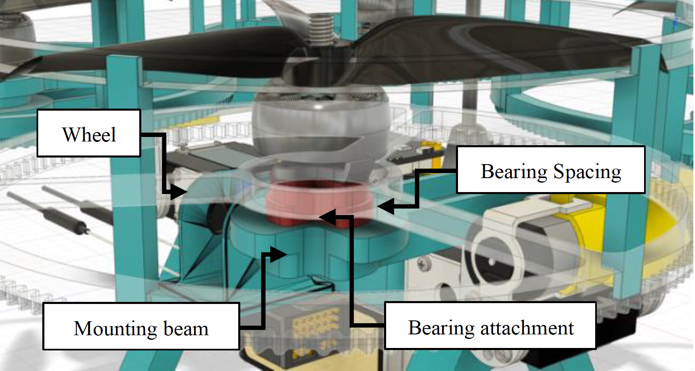
</p>

**Wheels.** Each wheel turns on a bearing to eliminate axle friction during ground motion. Both wheels are driven by a single DC motor through a common ring gear, so the wheels themselves are printed with **integrated gear teeth on the outer circumference** giving a **1:10 gear ratio** — high torque for climbing obstacles, in trade for top speed. The wheel webs are **topology-optimised** to remove material while preserving stiffness, also reducing aerodynamic drag in flight mode.

<p align="center">
  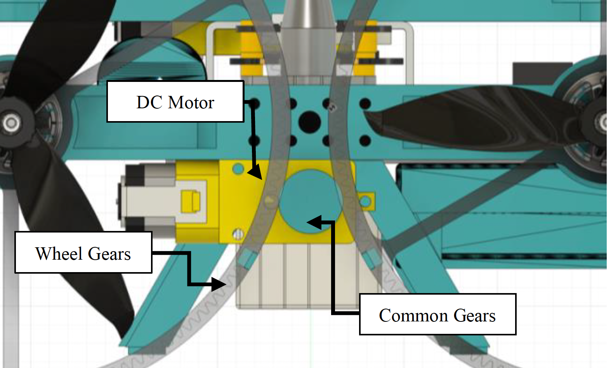
  &nbsp;
  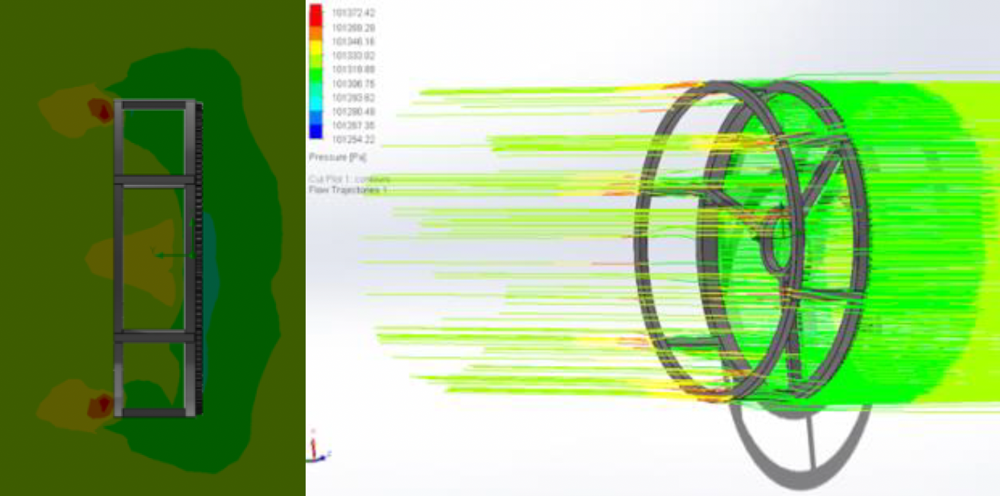
</p>

<p align="center">
  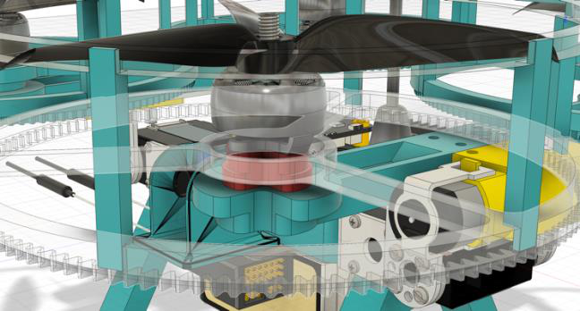
</p>

## Centre of Gravity

The CG is held close to the geometric centre of the frame by anchoring the battery (the heaviest single item) to the bottom of the central body. There is a deliberate **CG shift between modes**:

- **UAV mode** — CG is ~5 mm above the top of the central structure.
- **UGV mode** — CG is ~2 mm above the bottom of the central structure.

The two CG positions differ by ~23 mm (20 mm of which is the central plate thickness). In flight that puts the CG slightly *above* the rotor plane for predictable handling; on the ground it sits *below* the wheel axles, giving a low static stability margin against tipping.

<p align="center">
  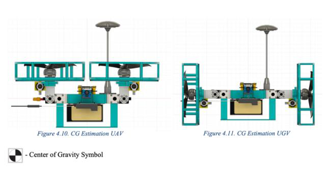
</p>

## Structural Analysis (FEA)

Static structural analysis was run in **Autodesk Fusion 360 Simulation** on the load-bearing parts. Loads are taken from worst-case flight forces (per-motor thrust + dynamic factor).

**Motor-arm beam.** Fixed at the centre (servo mount) with **20 N applied at each BLDC mounting hole**. Maximum von Mises stress is **5.742 MPa**, located between the servo and the BLDC mount — the expected stress concentration where the arm transitions from the servo coupling to the motor cantilever.

<p align="center">
  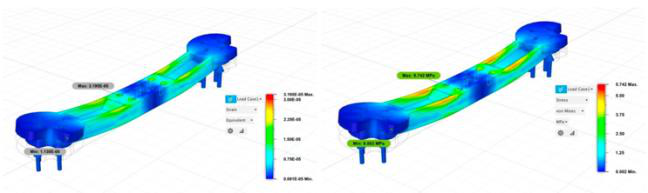
</p>

**Central structure (servo rear mount).** Fixed at the flight-controller mounting holes with **40 N per side** at the servo mounting holes (each side carries two BLDC motors at 20 N each). Maximum stress is **0.5 MPa** — a very high factor of safety, deliberately so since this part holds the entire reconfiguration mechanism.

<p align="center">
  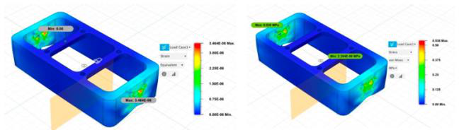
</p>

**Landing gear.** Skid type, chosen for stability and ground-contact area. Topology-optimised under landing-load constraints to maximise strength-to-weight. Maximum stress in the optimised geometry is **0.6 MPa**.

<p align="center">
  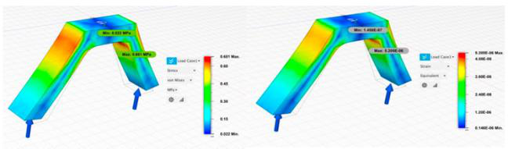
</p>

The landing-gear height (50 mm) is also constrained to be **smaller than the outer wheel radius**, so it never touches the ground in UGV mode — a 15 mm clearance is maintained throughout ground motion.

## Aerodynamics — Wheel Drag

Because the wheels stay on the airframe in UAV mode, their cross-section adds parasitic drag. Streamline analysis on the topology-optimised wheel shows the gear-tooth ring acts as a (mild) bluff body but the open spoke pattern lets most of the flow through, which was the goal of the optimisation:

<p align="center">
  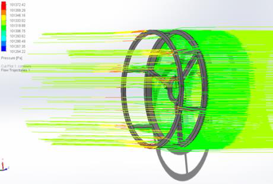
</p>

## Why a hybrid platform

A pure quadrotor wastes energy hovering and is unsafe near survivors and rubble. A pure ground robot can't cross gaps, climb collapsed slabs, or be deployed quickly across a wide search area. The reconfigurable approach uses each mode where it's actually efficient:

- **Fly** to the search zone — fast, terrain-independent.
- **Drive** inside the zone — orders-of-magnitude longer endurance, safer around people, and the static-stability margin means the vehicle can sit still without burning power.

## Status

Built, flown, and ground-driven. Reconfiguration is mechanical (servo-driven), GPS waypoint navigation works in UAV mode, and the FPV link feeds the ground station for manual operation in either mode.

## Credits

Concept inspired by the CalTech **M4 Morphbot**. Mechanical design, electronics integration, and bring-up by Tarunkumar Palanivelan.
